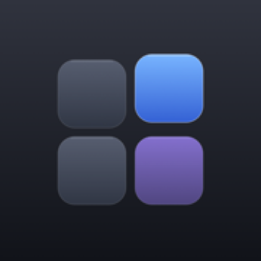
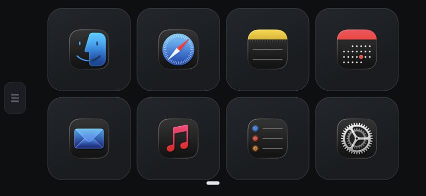
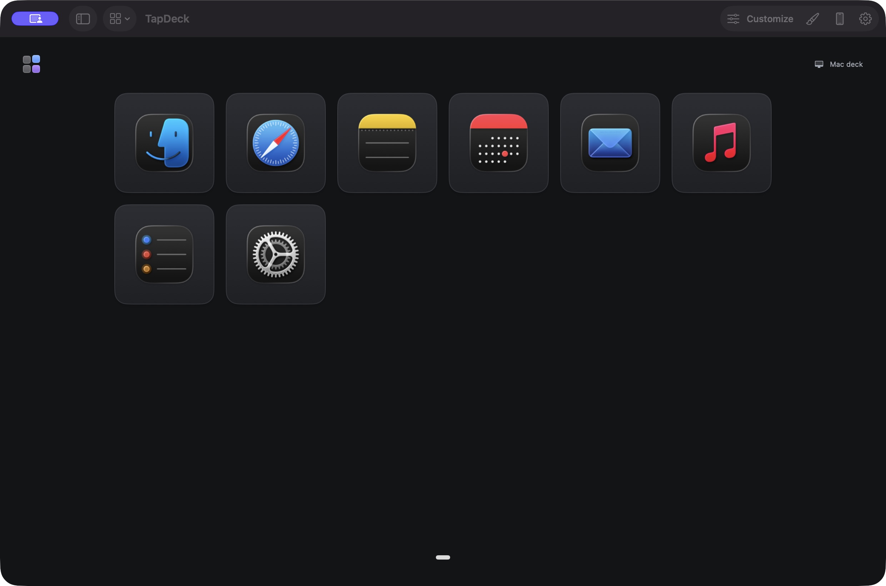

# TapDeck

### Your Mac. One tap away.

Apps, websites and shortcuts on a control deck in your phone’s browser. 
Create on your Mac. Scan a QR. Approve once. Tap from your phone.

**macOS 14+ · Apple silicon & Intel · No phone app required**

**[Download Mac preview ↓](https://github.com/wakeupbrk/TapDeck/releases/download/v0.3.7/TapDeck-0.3.7-Mac.dmg)** 
[Wiki help center](https://github.com/wakeupbrk/TapDeck/wiki) · [Release notes](https://github.com/wakeupbrk/TapDeck/releases/tag/v0.3.7) · [Get started](docs/GETTING-STARTED.md) · [Get help](SUPPORT.md) · [Roadmap](docs/ROADMAP.md)

> [!IMPORTANT]
> **0.3.7 is a seven-day preview.** The Mac app is ad hoc signed and unnotarized, so Gatekeeper may block it. Signing, notarization and remaining device acceptance checks are still ahead. Paid licenses are not available.

> [!TIP]
> **Using an older preview? Update to 0.3.7.** [Download the new Mac preview](https://github.com/wakeupbrk/TapDeck/releases/download/v0.3.7/TapDeck-0.3.7-Mac.dmg), quit TapDeck, and replace the app in Applications. Refresh Safari or your Home Screen controller afterward. Your deck and original trial expiry are retained. This preview update may require pairing the phone again and refreshing Accessibility permission; upgrading does not start a new trial.

## Start in three steps

1. **Install on your Mac.** Open the DMG, drag TapDeck to Applications and open it. Choose **Start or resume 7-day trial**.
2. **Connect your phone.** Choose the phone button in TapDeck, scan its QR with your phone’s Camera and approve the browser on your Mac.
3. **Make it yours.** Click a button to edit it. **Test** runs it on your Mac. Use **Add** for an app, website, file, keyboard command, or Shortcut, or drop an app onto the deck. Optionally add the controller to your phone’s Home Screen.

Both devices need internet access. Keep your Mac awake with TapDeck running. The phone uses its browser; there is no account to register or phone app to install. The [full setup guide](docs/GETTING-STARTED.md) covers installation, pairing and upgrades.

> Upgrading? Install **0.3.7** and replace the app in Applications. A 0.3.2 Mac app still connects. Builds older than 0.3.2 cannot reconnect. Your deck and original trial expiry are retained. After a preview update, pair the phone again if requested and confirm TapDeck’s Accessibility permission.

## What’s new in 0.3.7

Application buttons show gray when closed, red when minimized and green when visible. Tap to open, minimize or restore. The controller stays steady during presses; Finder has an open-only fallback when its windows cannot be controlled. Connection fixes stop old sessions and repeated network notifications from interrupting healthy sessions, and recover promptly when returning to the phone page.

## Build your everyday controls

| On your Mac | On your phone |
| --- | --- |
| Choose actions, icons, colors, decks and pages | Tap large icon buttons on fixed pages |
| Launch apps, open websites/files, run keyboard commands and Shortcuts | Reconnect with your saved pairing while the Mac is online |
| Arrange simple macros and export your deck with artwork | Switch decks and pages from a compact menu |
| Approve new browsers and revoke their access | Use Safari or a browser with WebCrypto and WebSocket support |

Keyboard controls need Accessibility permission on the Mac. Basic iPhone pairing, navigation, rotation and refresh/reconnect passed the user device session. Additional device/accessibility and clean-Mac checks remain on the release checklist.

<strong>See the Mac app</strong>

The starter includes Finder, Safari, Notes, Calendar, Mail, Music, Reminders and Settings. Click a button to select it, then use Test to run it. Drop an app onto the deck to add it. More workspace ideas are [on the roadmap](docs/ROADMAP.md).

## Find your way

| Looking for… | Go here |
| --- | --- |
| All guides in one place | [Wiki help center](https://github.com/wakeupbrk/TapDeck/wiki) |
| Installation, pairing and upgrading | [Getting started](docs/GETTING-STARTED.md) |
| A connection, permission or download problem | [Troubleshooting](docs/TROUBLESHOOTING.md) |
| Trial rules, requirements or release assets explained | [Frequently asked questions](docs/FAQ.md) |
| Changes in each preview | [Changelog](docs/CHANGELOG.md) |
| Upcoming features and priorities | [Roadmap](docs/ROADMAP.md) |
| A bug report or feature idea | [Support](SUPPORT.md) |
| A security concern | [Private reporting](SECURITY.md) |
| Data handling and usage terms | [Privacy](PRIVACY.md) · [Trial notice](LICENSE-TRIAL.txt) |

## Seven days, one Mac

Your trial begins at activation, not download. Reinstalling or clearing local data on the same Mac does not restart it. After expiry, controls lock and your saved deck remains exportable.

Before activation, TapDeck asks to send an app-specific hash derived from your Mac’s hardware UUID. The raw UUID is never sent. The service retains the hash and original activation/expiry timestamps indefinitely to prevent trial resets. Trial verification needs internet access. [Read the privacy details](PRIVACY.md).

## About this repository

This is TapDeck’s **public downloads and support hub**. It contains documentation, screenshots and compiled release assets. App development source is private.

GitHub automatically labels its repository archives “Source code”; here those archives contain public documentation and images. **Install the `.dmg` to get the app.** The checksum file verifies that your download matches the published build. [Release assets explained](docs/FAQ.md#which-release-file-should-i-download).

The preview uses the [proprietary trial notice](LICENSE-TRIAL.txt). Earlier license grants and third-party licenses are unaffected. See [third-party notices](THIRD-PARTY-NOTICES.txt) and [how to contribute feedback and documentation](CONTRIBUTING.md).
