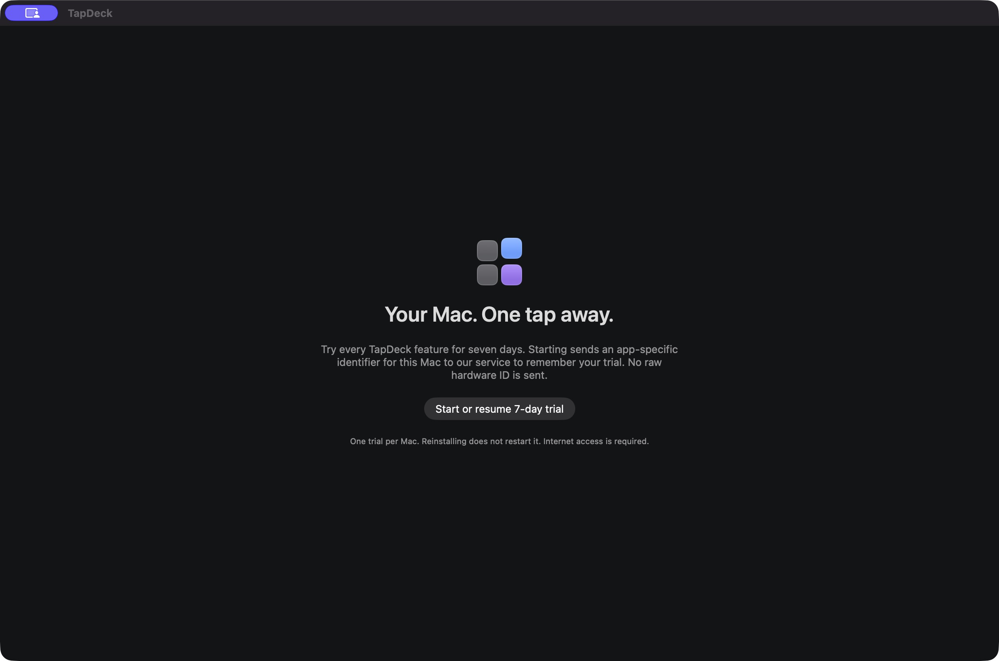

# Getting started

[← TapDeck](../README.md) · [Troubleshooting](TROUBLESHOOTING.md) · [FAQ](FAQ.md)

## Before you begin

- A Mac running macOS 14 or newer. The app supports Apple silicon and Intel.
- A phone browser with WebCrypto and WebSocket support. Safari and Chromium are the intended targets; physical iPhone acceptance is still pending.
- Internet access on both devices. They do not need the same Wi-Fi network.

The current release is **0.3.2**, an ad hoc signed, unnotarized preview. Review the [release notes](https://github.com/wakeupbrk/TapDeck/releases/tag/v0.3.2-security.1), [trial notice](../LICENSE-TRIAL.txt) and [privacy information](../PRIVACY.md) before activation.

## 1. Install the Mac app

1. Download [TapDeck-0.3.2-Mac.dmg](https://github.com/wakeupbrk/TapDeck/releases/download/v0.3.2-security.1/TapDeck-0.3.2-Mac.dmg).
2. Open the disk image and drag TapDeck into Applications. Keep one installed copy.
3. Open TapDeck. If macOS blocks it, consult [installation troubleshooting](TROUBLESHOOTING.md#macos-blocks-the-app).
4. Choose **Start or resume 7-day trial**. Activation asks for consent before sending the app-specific hardware hash. Declining leaves controls locked.

Your first activation starts seven consecutive days. Reinstalling does not restart the trial; failed online verification locks controls. Paid licenses are not available.

## 2. Pair your phone

1. Keep TapDeck running on your awake Mac.
2. Choose the phone button in the Mac app to display a QR invitation.
3. Scan it with your phone’s Camera and open the link.
4. Approve the browser on the Mac. The invitation lasts two minutes; generate another if it expires.
5. Return to the same browser to reconnect with its saved pairing.

The hosted controller is [tapdeck-connect.pages.dev](https://tapdeck-connect.pages.dev). Opening that address by itself shows pairing guidance; use the Mac’s QR to connect. Never share the QR or invitation URL.

## 3. Make it yours

Use **Customize** in the Mac app to configure your controls and drag them into order. Add apps, websites, files/folders, keyboard commands, Apple Shortcuts or simple macros. Change names, icons, colors and pages from the Mac. Extra controls belong on another fixed page.

Use the explicit test control when checking an action. Keyboard commands require Accessibility permission on the Mac; ordinary app and website actions do not. The phone requests configured action IDs and cannot edit your document.

## Add the controller to your Home Screen

On Safari, use **Share → Add to Home Screen**. Open that saved controller while TapDeck runs on your Mac. A separate Home Screen storage context may require pairing again. Private browsing or clearing browser data can also remove saved pairing.

## Upgrade an existing installation

Quit TapDeck, install the new DMG and replace the existing app in Applications. Open it again, then refresh your phone browser or Home Screen controller.

**0.3.2 requires the updated connection method.** Older Mac apps cannot reconnect. The upgrade preserves saved pairing credentials and the original trial timestamps; downloading again does not create a new trial.

## Back up or disconnect

Export your deck and artwork from the Mac before making large changes. Your deck remains exportable after trial expiry.

To remove a phone’s access, revoke its browser in Mac settings. **Forget this Mac** on the phone clears browser pairing and cached artwork; revoke on the Mac as well to invalidate access.

[Need help?](../SUPPORT.md)
